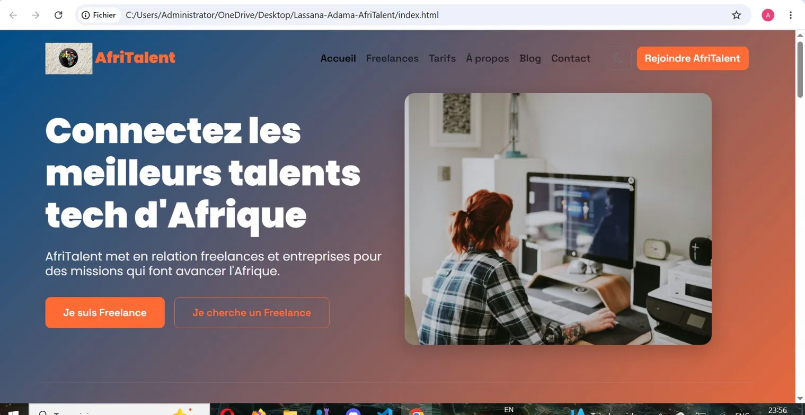

# AfriTalent 🌍

## Informations
- **Nom :** Lassana Adama
- **Classe :** L1 IAGE
- **Date :** 2026

## Description
AfriTalent est une plateforme fictive de mise en relation 
entre freelances tech et entreprises en Afrique. 
Ce site vitrine présente les services, les tarifs, 
les profils de freelances et permet aux visiteurs de s'inscrire.

## Technologies utilisées
- HTML5 sémantique
- CSS3 (Flexbox, Grid, Bento Grid, animations)
- Bootstrap 5
- JavaScript Vanilla
- Git & GitHub

## Fonctionnalités principales
- Dark mode / Light mode avec localStorage
- Filtrage dynamique des freelances par catégorie
- Compteurs animés au scroll (IntersectionObserver)
- Animations fade-in au scroll
- Formulaire de contact avec validation JavaScript
- Navbar dynamique au scroll
- Bouton retour en haut
- Design responsive (mobile, tablette, desktop)

## Lancer le projet localement
1. Cloner le dépôt :
git clone https://github.com/sibysahnom-source/Lassana-Adama-AfriTalent.git
2. Ouvrir index.html dans votre navigateur

## Lien GitHub Pages
https://sibysahnom-source.github.io/Lassana-Adama-AfriTalent

## Ressources consultées
- https://developer.mozilla.org/fr/
- https://getbootstrap.com/docs/5.3/
- https://fonts.google.com/
- https://icons.getbootstrap.com/
- https://unsplash.com/
## Aperçu du site
